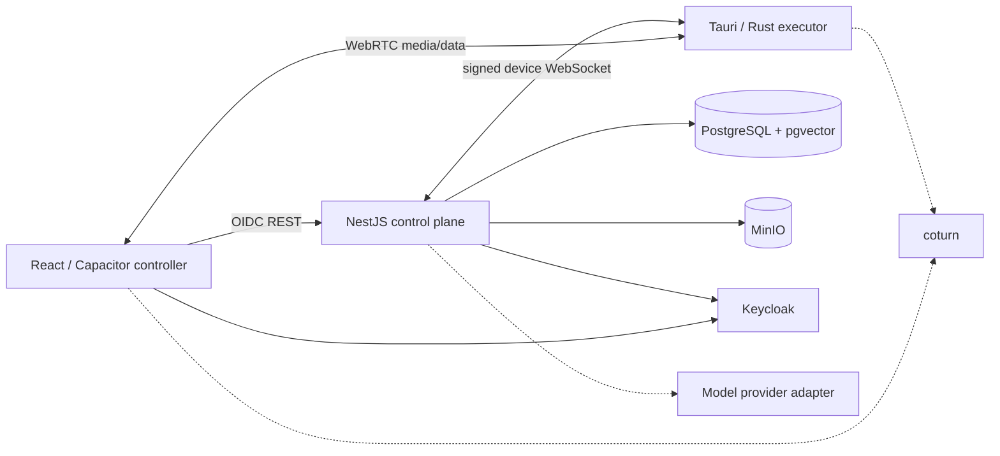

# Architecture and next implementation increment

## Runtime boundaries

The control plane persists intent, approval, and audit state. The executor owns OS authority. The controller never receives a general shell and the server cannot add local filesystem roots.

## Public contracts

`@continuum/protocol` owns the wire schemas. The most important envelope is a command containing `id`, `userId`, `targetDeviceId`, `tool`, `args`, `risk`, `status`, `idempotencyKey`, `expiresAt`, and timestamps. The server derives `risk` from the tool policy and ignores any equivalent client input.

Realtime device messages support authentication, heartbeat, action results, dispatch, and WebRTC signaling. REST exposes devices, commands, approvals, memory, file versions, improvement candidates, and audit events under `/v1`.

## Native completion work

1. Add a capture producer using Windows Graphics Capture and macOS ScreenCaptureKit. Encode H.264/AV1 in the executor and attach the track to the existing WebRTC session.
2. Add Windows UI Automation and macOS Accessibility adapters for semantic elements first. Keep coordinate-based pointer injection behind the existing `screen.control` approval and a short-lived session grant.
3. Sign each interactive input event with the session grant, enforce sequence numbers, and stop immediately on grant expiry, WebRTC disconnect, local escape-key action, or permission revocation.
4. Add a Rust filesystem watcher per approved sync root. Debounce changes, hash content, request a presigned upload, upload, then register completion. Preserve both branches when `baseVersionId` is not the current head.
5. Replace the MVP biometric boolean with a cryptographically verified WebAuthn assertion bound to `commandId`, decision, user, and expiry.
6. Move OIDC refresh tokens from browser storage to native secure storage in packaged mobile/desktop clients.

## Acceptance checks

- Replayed or expired commands never execute twice; cached terminal results may be resent safely.
- A second account cannot query, signal, approve, or execute against the first account's device.
- Path traversal and symlink escapes fail on Windows and macOS.
- Revoking screen-recording or accessibility permission terminates the session without crashing the executor.
- Direct WebRTC and TURN-relayed sessions both connect; disconnect tears down capture and input immediately.
- Concurrent edits from the same base produce two visible versions and never silently overwrite content.
- A candidate cannot become active until evaluation passes and the user explicitly activates it; rollback restores the previous active version.
